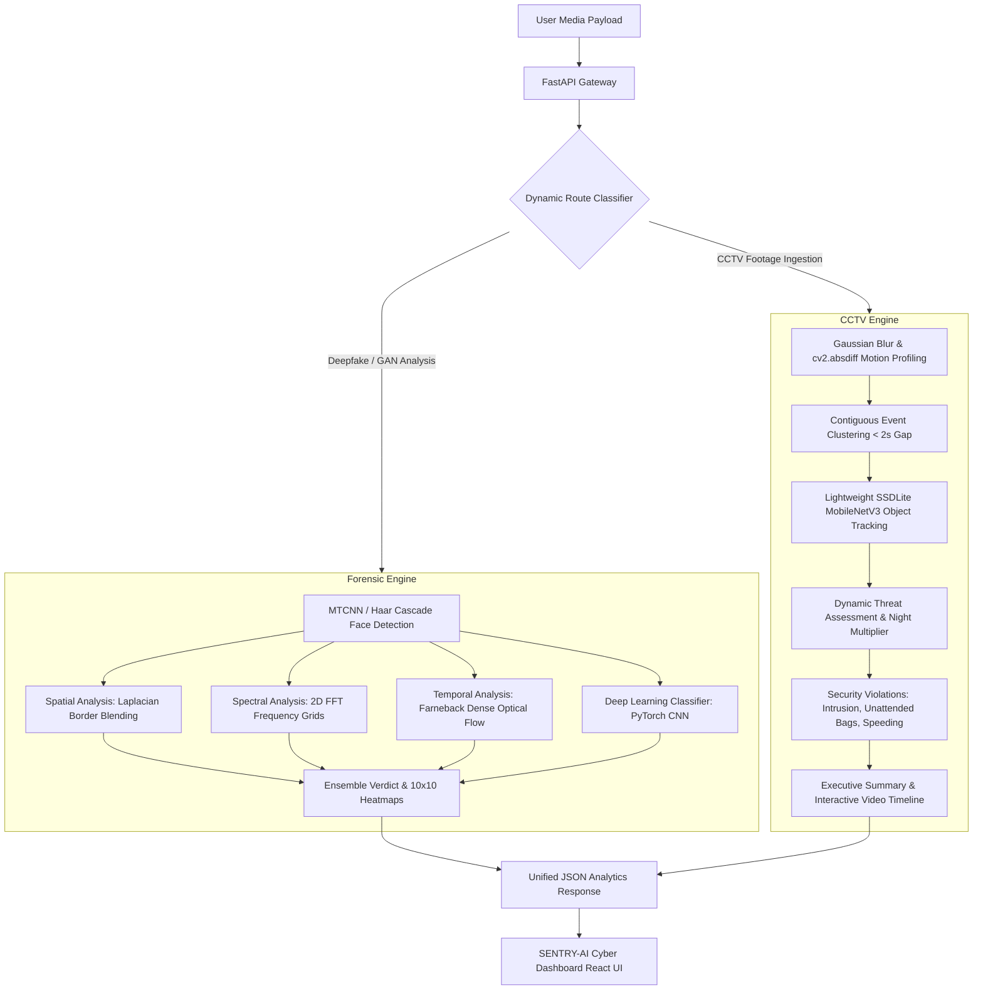

# 🌌 SENTRY-AI // Next-Gen DeepForensics & CCTV Intelligence Platform

[](https://opensource.org/licenses/MIT)
[](https://fastapi.tiangolo.com)
[](https://react.dev)
[](https://pytorch.org)
[](https://opencv.org)

**SENTRY-AI** is a premium, high-performance security platform that integrates two powerful modules: a **Multi-Dimensional Deepfake & GAN Forensics Engine** and an **Asynchronous CCTV Video Summarization & Threat Analytics Engine**. 

Designed for security analysts, digital forensic experts, and surveillance operators, SENTRY-AI features a state-of-the-art cyberpunk-themed React console backed by a high-throughput async FastAPI server. It exposes microscopic generative anomalies in images/video and condenses hours of CCTV footage into short, actionable intelligence timelines.

---

## 🛠️ System Architecture



---

## ✨ Key Features

### 1. Multi-Dimensional Deepfake Forensics
*   **Spatial Artifact Detection**: Analyzes boundary blending degradation (comparing Laplacian variance of outer face boundaries vs. inner regions), lighting vector asymmetry (horizontal Sobel X luminance gradient asymmetry checks), and localized texture noise.
*   **Frequency-Domain (Spectral) Analysis**: Utilizes a 2D Fast Fourier Transform (FFT) on face crops to map their radial magnitude spectrum. Exposes periodic high-frequency patterns left by generative upsampling/deconvolution layers, outputting an interactive **10x10 anomaly grid**.
*   **Temporal Optical Flow**: Computes Farneback Dense Optical Flow between consecutive face frames to register temporal glitches, facial fluttering, and velocity standard deviation jumps typical of deepfake splices.
*   **PyTorch Deep Learning Classifier**: Plugs in a custom-trained CNN classifier (`DeepfakeClassifier`) mapping probabilities of synthetic tampering with GPU/CUDA hardware acceleration support.

### 2. CCTV Video Summarization & Threat Analytics
*   **Active Motion Profiling**: Extracts pixel-level frame changes to output a raw temporal motion profile, visualized through responsive line charts.
*   **Activity Event Clustering**: Group contiguous frames exceeding a 1.2% motion threshold into cohesive timeline events, merging brief interruptions (gaps < 2.0s).
*   **Neural Object Tracking**: Employs a lightweight pre-trained `SSDLite-MobileNetV3` tracking 15 COCO classes (Person, Vehicle, Bag, Suitcase, etc.) with a contour-based aspect-ratio fallback for hardware-constrained environments.
*   **Automated Security Violation Detection**:
    *   *Night Intrusion / Trespassing*: People detected during late-night hours (9 PM - 6 AM).
    *   *Unattended Baggage*: Bags or suitcases left stationary/active for more than 5.0 seconds.
    *   *Reckless Driving*: High-velocity pixel shifts in vehicle vectors.
    *   *Altercation / Panic Alerts*: Excessive motion intensity changes.
*   **Executive Intelligence Brief**: Synthesizes a natural language summary of events, activity ratios, and overall threat assessments (Secure, Warning, Critical).

---

## 📂 Project Structure

```directory
deepfake_detector/
├── backend/
│   ├── app/
│   │   ├── config.py              # Configuration settings, file size limits & extensions
│   │   ├── main.py                # FastAPI app router, endpoints, & static mounting
│   │   ├── forensic_engine.py     # Algorithms for spatial, spectral, optical flow & DL inference
│   │   └── cctv_engine.py         # CCTV motion profile extraction, event clustering & SSDLite tracker
│   ├── requirements.txt           # Python backend dependencies
│   ├── train.py                   # PyTorch dataset preprocessing & model training script
│   └── uploads/                   # Temp buffer directory for file uploads
├── dataset/                       # Pre-processed training dataset directory (real/fake folders)
├── frontend/
│   ├── src/
│   │   ├── components/
│   │   │   ├── CyberDashboard.jsx # Cyberpunk command console and metrics portal
│   │   │   ├── CctvSummarizer.jsx # CCTV timeline events, profiles, and keyframe/crop viewer
│   │   │   ├── ForensicHeatmap.jsx# 10x10 spectral high-frequency anomaly visualizer
│   │   │   ├── MetricCard.jsx     # Glowing UI card items
│   │   │   ├── StageTracker.jsx   # Pipeline processing status steps
│   │   │   └── VideoUpload.jsx    # Advanced upload dropzone with progress bars
│   │   ├── App.jsx                # Main entry point importing CyberDashboard
│   │   ├── index.css              # Custom neon gradients, scrollbars & Tailwind base
│   │   └── main.jsx               # React DOM rendering
│   ├── package.json               # Frontend dependencies & Vite scripts
│   ├── tailwind.config.js         # Custom border colors, neon shadows & fonts configuration
│   └── vite.config.js             # Vite development server settings
├── models/                        # Serialized PyTorch weight files (deepfake_classifier.pth)
├── static/
│   └── sampled/                   # Extracted static frame sequences, crops, and keyframes
├── generate_presentation.py       # Python script generating PowerPoint presentations of Sentry AI
└── run_servers.bat                # Windows launcher batch script for dual-server startup
```

---

## ⚡ Setup & Installation

### Prerequisites
*   **Python 3.10+** (Recommended)
*   **Node.js 18+** & **npm**

### 1. Backend Setup
1.  Navigate to the `backend` directory:
    ```bash
    cd backend
    ```
2.  Create a virtual environment:
    ```bash
    python -m venv .venv
    ```
3.  Activate the virtual environment:
    *   **Windows**: `.venv\Scripts\activate`
    *   **macOS/Linux**: `source .venv/bin/activate`
4.  Install the required packages:
    ```bash
    pip install -r requirements.txt
    ```

### 2. Frontend Setup
1.  Navigate to the `frontend` directory:
    ```bash
    cd ../frontend
    ```
2.  Install packages:
    ```bash
    npm install
    ```

---

## 🚀 Running the Application

### The Easy Way (Windows Launcher)
Double-click `run_servers.bat` in the project root. This batch script will automatically:
1.  Activate your Python virtual environment.
2.  Boot up the FastAPI server on `http://localhost:8000`.
3.  Run the Vite development server on `http://localhost:5173`.
4.  Open the backend and frontend logs in two separate command-prompt windows.

### Manual Commands
If you prefer running services manually:

*   **Start Backend** (from `backend` folder with active `.venv`):
    ```bash
    uvicorn app.main:app --host 0.0.0.0 --port 8000 --reload
    ```
*   **Start Frontend** (from `frontend` folder):
    ```bash
    npm run dev
    ```

Once loaded, access the dashboard at **`http://localhost:5173`**!

---

## 🧠 Model Training (Deepfake PyTorch Classifier)

If you wish to train or refine the deep learning classifier model with custom image/video samples:

1.  Place your raw training samples in the `dataset/real` and `dataset/fake` directories.
2.  Run the training pipeline from the `backend` folder:
    ```bash
    python train.py
    ```
3.  **What happens next**:
    *   `train.py` automatically runs `preprocess_dataset()` to extract face crops (using Haar Cascade fallbacks) and resizes them to `224x224`.
    *   Extracted face crops are saved under `dataset/processed/real` and `dataset/processed/fake`.
    *   It splits data (80% training / 20% validation) and applies standard augmentations (rotations, flips, color jitters).
    *   Trains the CNN architecture for 15 epochs, weighting loss to balance real/fake splits, and exports the best epoch weights to `models/deepfake_classifier.pth`.
    *   The `ForensicEngine` automatically loads this new weights file on the next server reboot!

---

## 🌌 User Interface Details
The SENTRY-AI Console is optimized for modern monitors:
*   **Dashboard Modes**: Fluid transition button to alternate between **Deepfake Forensics** and **CCTV Summarizer** dashboards.
*   **Glowing Verdict Badges**: Red (`COMPROMISED` / `CRITICAL`), Orange (`SUSPICIOUS` / `WARNING`), and Green (`AUTHENTIC` / `SECURE`) indicators based on automated vision checks.
*   **Interactive Event Timelines**: Event lists show timestamp locations, classification tags, threat parameters, and security violations. Clicking an event instantly loads the full keyframe, cropped view bounding box, and natural language summary description.
*   **Advanced Charts**: Line charts render frame-by-frame motion velocity vectors dynamically.
*   **Forensic Heatmap**: The 10x10 spectral density grid maps localized high-frequency concentrations directly, displaying precise hover percentages.

---

## 🛡️ License
Distributed under the MIT License. See `LICENSE` for more information.
